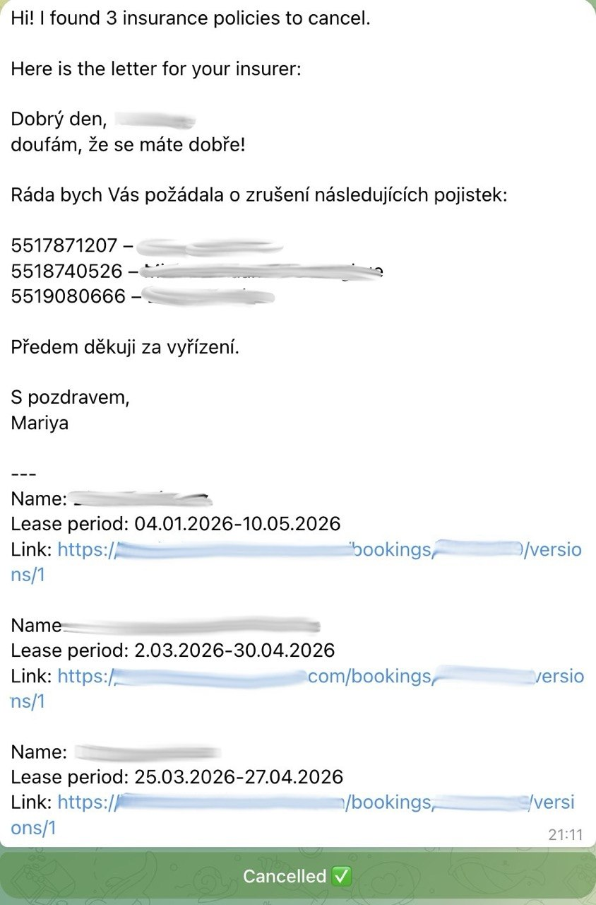

## AI Property Insurance Agent

An autonomous AI agent designed for property management. It automates the routine process of tracking lease dates vs. insurance policies, communicating with insurers, and managing task states via Telegram.

 

## The Problem
Property managers waste hours manually cross-referencing hundreds of active lease agreements with insurance expiration dates. Missing a cancellation means losing money, and missing a renewal leaves the property at risk.

## The Solution
This Python-based agent fully automates the workflow:
1. **Data Sync:** Connects to Google Sheets API to read the actual state of reservations and insurances.
2. **Logic Engine:** Calculates if a policy needs to be cancelled (guest left) or renewed (guest stayed but policy expired).
3. **Human-in-the-loop (Telegram):** Sends a ready-to-forward cancellation/renewal letter template directly to Telegram.
4. **NLP Processing (LLM):** If the manager replies *"Don't cancel for Johann and the last guy"*, the system uses **OpenAI (GPT-4o)** to process the natural language, map it to the active list, and exclude the correct guests.
5. **State Management:** Remembers pending tasks and follows up after 48 hours to ask if the insurer confirmed the cancellation.

## Tech Stack
- **Python 3.10+**
- **Google Sheets API** (Data source)
- **Telegram Bot API** (UI & Notifications)
- **OpenAI API (GPT-4o-mini)** (Natural language instructions processing)
- **Python-dotenv** (Secrets management)

##  Architecture
- `main.py` — Pipeline orchestrator.
- `logic.py` — Business rules for cancellation and renewal.
- `bot.py` — Telegram async bot handlers & UI (Inline Keyboards).
- `llm.py` — OpenAI integration for natural language lists exclusion.
- `memory.py` — JSON-based state persistence layer (handles short-term and long-term memory for active policies).
- `sheets.py` — Google Workspace API wrapper.
- `scheduler.py` — Daily job scheduler with randomized execution time (10:00–17:00 Prague time).

## Setup
1. Clone the repository.
2. Install dependencies: `pip install -r requirements.txt`
3. Set up environment variables in a `.env` file:
   ```ini
   TELEGRAM_TOKEN=your_bot_token
   CHAT_ID=your_telegram_chat_id
   SPREADSHEET_ID=your_google_sheet_id
   OPENAI_API_KEY=your_openai_key# 
